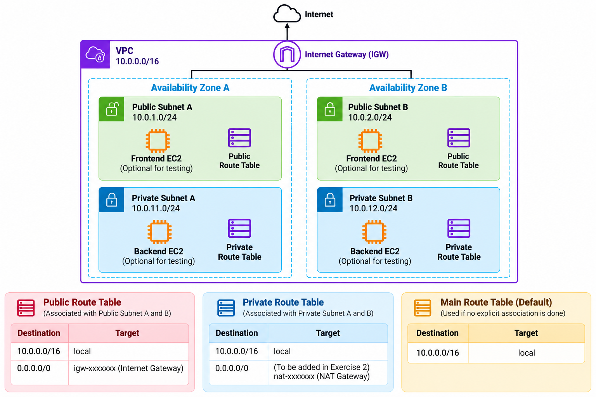

# Exercise 1 — Design a Highly Available VPC

**Days:** 1–2

## Scenario



Your engineering team is building the network foundation for **OrderHub**, an e-commerce backend platform. 

OrderHub's target architecture will eventually consist of three tiers:
1. **Public Frontend Tier**: Handles incoming HTTPS traffic and API routing.
2. **Private Backend Tier**: Hosts core business microservices and OrderHub APIs.
3. **Private Database Tier**: Stores transactional customer data and order state.

To meet production uptime SLAs, the network architecture must survive an infrastructure failure in any single AWS Data Center / Availability Zone (AZ). If `us-east-1a` experiences an outage, OrderHub services in `us-east-1b` must remain functional without network re-configuration.

In this exercise, you will design and build the core multi-AZ Virtual Private Cloud (VPC) for OrderHub in **Account A (Development / us-east-1)**. You will choose a suitable non-overlapping CIDR block for your VPC, plan subnet CIDR allocations across two Availability Zones, set up route tables, establish local VPC routing, and configure VPC DNS resolution.

---

## Prerequisites

IPv4, CIDR, Subnetting, VPC, Subnet, Availability Zone, Route Table, Basic Routing, DNS Basics

---

## YouTube Videos

- **Abhishek.Veeramalla — Learn Networking in 3 Hours | Networking Fundamentals + AWS VPC Networking**
  - Link: https://www.youtube.com/watch?v=iSOfkw_YyOU
  - Verified Timestamps:
    - `00:58` — IP Address, CIDR, Subnets, Ports
    - `1:11:32` — AWS Networking
    - `2:25:35` — AWS VPC Hands-on

---

## Build

Follow these high-level steps in the AWS Management Console for **Account A (Development Account)** in Region **us-east-1**.

```text
VPC-A (Development VPC CIDR)
 ├── AZ-A (us-east-1a)
 │    ├── Public Subnet A (Public Subnet A CIDR)
 │    └── Private Subnet A (Private Subnet A CIDR)
 └── AZ-B (us-east-1b)
      ├── Public Subnet B (Public Subnet B CIDR)
      └── Private Subnet B (Private Subnet B CIDR)
```

### Step 1 — Plan CIDR Allocations & Create VPC
1. Choose a suitable non-overlapping IPv4 CIDR block for `VPC-A` (e.g., a `/16` network block).
2. Plan non-overlapping subnet CIDR blocks for your 4 subnets (e.g., `/24` network blocks carved out of `VPC-A CIDR`).
3. Open the AWS VPC Console in `us-east-1`.
4. Create a VPC named `VPC-A` with your chosen `VPC-A CIDR`.
5. Select **No IPv6 CIDR block** and keep tenancy as **Default**.

### Step 2 — Enable VPC DNS Settings
1. Select `VPC-A`.
2. Under **Actions**, click **Edit VPC settings**.
3. Enable **Enable DNS resolution**.
4. Enable **Enable DNS hostnames**.
5. Save changes.

### Step 3 — Create Subnets
Create 4 non-overlapping subnets within `VPC-A` using your planned CIDR blocks:

1. **Public Subnet A**:
   - Name: `Public-Subnet-A`
   - Availability Zone: `us-east-1a`
   - CIDR block: `Public Subnet A CIDR`
2. **Private Subnet A**:
   - Name: `Private-Subnet-A`
   - Availability Zone: `us-east-1a`
   - CIDR block: `Private Subnet A CIDR`
3. **Public Subnet B**:
   - Name: `Public-Subnet-B`
   - Availability Zone: `us-east-1b`
   - CIDR block: `Public Subnet B CIDR`
4. **Private Subnet B**:
   - Name: `Private-Subnet-B`
   - Availability Zone: `us-east-1b`
   - CIDR block: `Private Subnet B CIDR`

### Step 4 — Create Route Tables
1. Create a custom route table named `Public-Route-Table` in `VPC-A`.
2. Create a custom route table named `Private-Route-Table` in `VPC-A`.

### Step 5 — Associate Subnets with Route Tables
1. Associate `Public-Subnet-A` and `Public-Subnet-B` with `Public-Route-Table`.
2. Associate `Private-Subnet-A` and `Private-Subnet-B` with `Private-Route-Table`.

### Step 6 — Verify Configurations
1. Verify that every subnet displays the expected available IP address capacity (total IPs for the subnet mask minus 5 reserved by AWS).
2. Inspect the **Routes** tab for both route tables and confirm the implicit `VPC CIDR → local` route is present.

---

## Scenario-Based Verification & Troubleshooting

### Scenario 1 — Wrong Subnet Association
- **Symptom:** An instance launched in `Private-Subnet-B` is receiving network policies meant for public subnets, or behaves differently from `Private-Subnet-A`.
- **Investigation:**
  1. Navigate to **VPC > Subnets** in the AWS Console.
  2. Select `Private-Subnet-B` and inspect the **Route table** tab.
  3. Compare the associated Route Table ID with `Private-Subnet-A`.
  4. Check if `Private-Subnet-B` is using the main VPC route table or `Public-Route-Table` by mistake.
- **Verification:** Re-associate `Private-Subnet-B` with `Private-Route-Table`. Verify that its route table explicit association listing shows `Private-Subnet-A` and `Private-Subnet-B`.
- **Reasoning:** Subnets in AWS inherit routes from their associated Route Table. If no explicit association is created, AWS assigns the subnet to the VPC's main route table by default, leading to inconsistent routing behavior.

### Scenario 2 — Traffic Between Two Subnets in the Same VPC
- **Symptom:** A developer asks whether traffic between an application in `Public-Subnet-A` (`Frontend Instance Private IP`) and a private backend in `Private-Subnet-B` (`Backend Instance Private IP`) needs an Internet Gateway or external router.
- **Investigation:**
  1. Select the route table associated with `Public-Subnet-A`.
  2. Look at the target for the destination matching `VPC CIDR`.
- **Questions to Answer:**
  - Does traffic destined for `Backend Instance Private IP` exit the VPC?
  - Which route entry matches `Backend Instance Private IP`?
  - What component handles routing between subnets in the same VPC?
- **Verification:** Explain that AWS VPC handles all inter-subnet routing inside the VPC via the default `local` route (`VPC CIDR → local`). No Internet Gateway, NAT, or virtual router appliance is required for subnets inside the same VPC to communicate with each other.
- **Reasoning:** Every route table created in an AWS VPC automatically includes a local route matching the VPC CIDR. This route cannot be deleted or modified. AWS software-defined networking routes all traffic matching `VPC CIDR` directly between subnets within the VPC.

### Scenario 3 — CIDR Planning Problem & VPC Peering Conflict
- **Symptom:** OrderHub needs to connect its Development VPC (`VPC-A`) to a Partner VPC in the future. Someone proposes creating the Partner VPC using the exact same CIDR block as `VPC-A`.
- **Investigation:**
  1. Analyze what happens when two networks with identical CIDR blocks are connected via VPC Peering or VPN.
  2. Evaluate how a router decides where to send a packet when both local and peered networks claim the same IP range.
- **Questions to Answer:**
  - Why does AWS VPC Peering prohibit establishing a peering connection between VPCs with overlapping CIDR blocks?
  - Why must CIDR block allocation be planned across the organization before creating VPCs?
  - What is a non-overlapping CIDR strategy for secondary environments (e.g., assigning distinct `Development VPC CIDR` vs `Production VPC CIDR`)?
- **Verification:** Document why overlapping CIDR ranges break IP routing fundamentals and confirm `VPC-A CIDR` and `VPC-B CIDR` are planned as non-overlapping ranges.
- **Reasoning:** IP routing relies on unambiguous destination addresses. If two networks share the same IP space, packets cannot be deterministically routed to the correct destination.

### Scenario 4 — One Availability Zone Failure
- **Symptom:** AWS reports a major data center power outage affecting `us-east-1a`.
- **Investigation:**
  1. Map out which subnets reside in `us-east-1a` (`Public-Subnet-A`, `Private-Subnet-A`) vs `us-east-1b` (`Public-Subnet-B`, `Private-Subnet-B`).
  2. Determine which resources survive the outage.
- **Questions to Answer:**
  - If all workloads were deployed only in `us-east-1a` across 4 subnets, would OrderHub remain online?
  - Why does spreading subnets across multiple physical AZs provide High Availability (HA), whereas creating multiple subnets in a single AZ does not?
- **Verification:** Confirm that subnets in `us-east-1b` remain fully operational because Availability Zones represent physically isolated locations with independent power, cooling, and networking.
- **Reasoning:** An Availability Zone is one or more discrete data centers. Subnets are bound to a single AZ. Creating multiple subnets in one AZ provides logical isolation, but zero physical fault tolerance against data center failures. Multi-AZ deployment is mandatory for HA.

### Scenario 5 — Route Selection & Longest Prefix Match
- **Symptom:** A route table contains the following entries:
  - Route 1: `VPC CIDR → local`
  - Route 2: `Target Subnet CIDR → target-x`
  - Packet destination: An IP address located inside `Target Subnet CIDR`.
- **Investigation:**
  1. Compare prefix lengths (e.g., a `/16` VPC mask vs a `/24` subnet mask).
  2. Determine which route rule takes precedence under standard IP routing rules.
- **Questions to Answer:**
  - Both `VPC CIDR` and `Target Subnet CIDR` encompass the destination IP. Which route does AWS choose?
  - What is the "Longest Prefix Match" rule?
- **Verification:** Confirm that AWS routes the packet to `target-x` because the subnet prefix is a longer, more specific bit-mask match than the VPC prefix.
- **Reasoning:** AWS VPC routers strictly follow standard IP routing behavior: when multiple routes match a destination IP, the route with the most specific prefix (highest prefix number / longest subnet mask) is always chosen.

### Scenario 6 — DNS Settings & Private Endpoint Name Resolution
- **Symptom:** An application team attempts to resolve internal AWS service DNS names within `VPC-A`, but standard DNS queries fail or return public IP addresses instead of VPC-local addresses.
- **Investigation:**
  1. Navigate to **VPC > Your VPCs > VPC-A**.
  2. Inspect **DNS settings**:
     - **Enable DNS resolution**: controls whether the Amazon-provided DNS server (at the VPC network base + 2) is active.
     - **Enable DNS hostnames**: controls whether EC2 instances in the VPC receive public/private DNS hostnames.
- **Verification:** Ensure both `Enable DNS resolution` and `Enable DNS hostnames` are set to `Enabled`.
- **Reasoning:** AWS Interface Endpoints and SSM Session Manager depend on private DNS resolution to resolve AWS service domain names (e.g., `ssm.us-east-1.amazonaws.com`) to private IP addresses inside the VPC. If DNS settings are disabled, private endpoint resolution fails.

---

## Networking

- **VPC CIDR:** The primary IPv4 network range assigned to your isolated virtual network (e.g., a `/16` block providing 65,536 IP addresses).
- **Subnet CIDR:** A sub-range of the VPC CIDR assigned to a specific Availability Zone (e.g., a `/24` block providing 256 IP addresses, 251 usable).
- **Availability Zone (AZ):** Isolated data center locations within an AWS Region engineered to be isolated from failures in other AZs.
- **Route Table:** A set of rules (routes) used to determine where network traffic from your subnet or gateway is directed.
- **Route Table Association:** The explicit link connecting a subnet to a specific route table.
- **Local Route:** The default non-deletable route (`VPC CIDR → local`) that enables all subnets inside the same VPC to communicate with each other.
- **Public vs Private Subnet:** A subnet is public if its route table directs default outbound traffic (`0.0.0.0/0`) to an Internet Gateway. A subnet is private if it has no direct route to an Internet Gateway.
- **Longest Prefix Match:** The standard IP routing algorithm where the router selects the route entry with the most specific subnet mask matching the destination IP.
- **VPC DNS:** Built-in AWS DNS capabilities (Amazon-provided DNS at base VPC IP + 2) required for private domain name resolution.

---

## Useful Tips

- A subnet is strictly tied to a single Availability Zone upon creation and cannot span multiple AZs.
- Always ensure subnet CIDRs are strictly non-overlapping within the VPC and across peered VPCs.
- When subnet traffic behaves unexpectedly, verify its explicit Route Table Association first before inspecting OS firewalls.
- Always plan VPC CIDR blocks systematically across Development, Staging, and Production environments prior to deployment to prevent VPC Peering conflicts.
- Always enable both **DNS resolution** and **DNS hostnames** when creating a VPC to support AWS Interface Endpoints and SSM.
