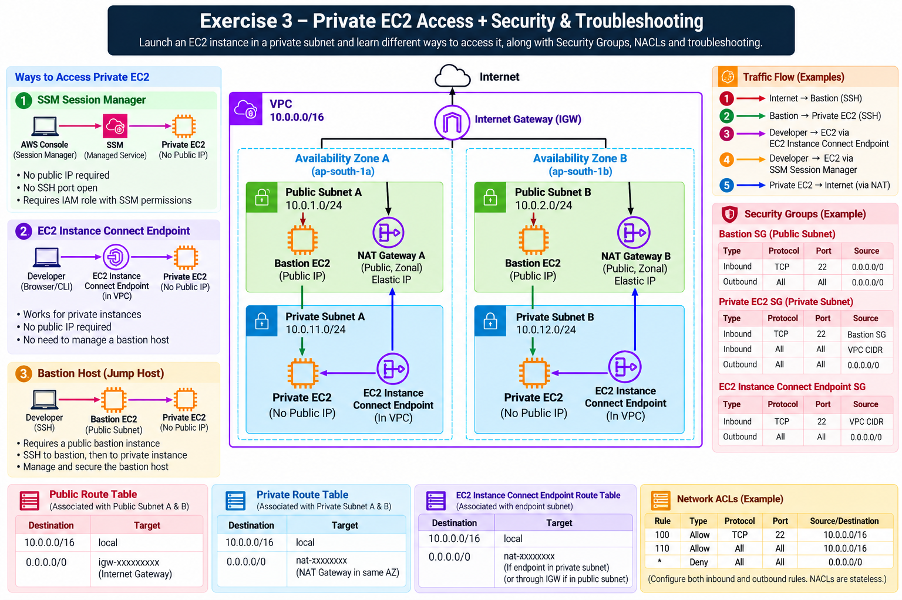

# Exercise 3 — Security & Network Troubleshooting

**Days:** 5–6

## Scenario



OrderHub's development environment is fully built out in **VPC-A (Account A / us-east-1)**. However, developers and backend engineers have begun reporting intermittent and confusing network failures:
- Engineers cannot SSH into the Bastion server.
- The Bastion server can connect to some private backend instances, but not others.
- `ping` commands fail between instances even when HTTP access appears to work.
- Security Group updates made by developers fail to unblock application connections.

As the backend infrastructure engineer, you must systematically diagnose and resolve these network security issues using **Security Groups**, **Network ACLs (NACLs)**, **VPC Flow Logs**, and **AWS Reachability Analyzer**.

---

## Prerequisites

Security Groups, NACL, TCP, UDP, ICMP, Ports, Route Tables, CIDR, Stateful vs Stateless

---

## YouTube Videos

- **Abhishek.Veeramalla — Day-5 | AWS Security Group and NACL | Theory + Practical**
  - Link: https://www.youtube.com/watch?v=TtlKFgfN3PU
- **Abhishek.Veeramalla — Learn Networking in 3 Hours | Networking Fundamentals + AWS VPC Networking**
  - Link: https://www.youtube.com/watch?v=iSOfkw_YyOU
  - Verified Timestamp:
    - `1:40:22` — AWS Security Groups & NACL

---

## Build

Follow these steps to configure security rules and diagnostic tools in **VPC-A (Account A)**:

### Step 1 — Configure Bastion Security Group (`Bastion-SG`)
1. Create a Security Group named `Bastion-SG` in `VPC-A`.
2. **Inbound Rules:**
   - Type: `SSH` | Protocol: `TCP` | Port: `22` | Source: `0.0.0.0/0`
3. **Outbound Rules:**
   - Type: `Custom TCP` | Protocol: `TCP` | Port Range: `22` | Destination: `Production VPC CIDR`
   - Type: `All Traffic` | Destination: `Development VPC CIDR`

### Step 2 — Configure Target EC2 Security Group (`Target-EC2-SG`)
1. Create a Security Group named `Target-EC2-SG` in `VPC-A`.
2. **Inbound Rules:**
   - Type: `SSH` | Protocol: `TCP` | Port: `22` | Source: `Public Subnet A CIDR` (or `Bastion Subnet CIDR`)
3. **Outbound Rules:**
   - Type: `All Traffic` | Destination: `0.0.0.0/0`

### Step 3 — Review Network ACLs (NACLs)
1. Navigate to **VPC > Network ACLs**.
2. Inspect the `Default-NACL` associated with `Public-Subnet-A` and `Private-Subnet-A`.
3. Confirm Rule `100` allows all traffic inbound and outbound (`0.0.0.0/0`).

### Step 4 — Enable VPC Flow Logs
1. Go to **VPC > Your VPCs > VPC-A**.
2. Select the **Flow logs** tab and click **Create flow log**.
3. **Settings:**
   - Filter: `All` (capture ACCEPT and REJECT traffic).
   - Maximum aggregation interval: `1 minute`.
   - Destination: `Send to CloudWatch Logs` (or S3 log bucket).

### Step 5 — Configure Reachability Analyzer Path Test
1. Navigate to **VPC > Reachability Analyzer**.
2. Click **Create and analyze path**:
   - **Source type:** `Network Interfaces` (or Instance: `Bastion-EC2`).
   - **Destination type:** `Network Interfaces` (or Instance: `App-EC2`).
   - **Protocol:** `TCP` | **Port:** `22`.

---

## Scenario-Based Verification & Troubleshooting

### Scenario 1 — SSH Connection to Bastion Fails
- **Symptom:** An engineer attempts `ssh ec2-user@<BASTION-PUBLIC-IP>` and receives `Connection timed out`.
- **Systematic Investigation:**
  1. **EC2 State:** Verify `Bastion-EC2` state is `Running` and Status Checks are `2/2 passed`.
  2. **Public IP:** Confirm instance has a valid Public IPv4 address.
  3. **Route Table:** Inspect `Public-Route-Table` associated with `Public-Subnet-A` for `0.0.0.0/0 → IGW-A`.
  4. **Security Group (`Bastion-SG`):** Check inbound rules for TCP Port 22 from client IP or `0.0.0.0/0`.
  5. **NACL:** Inspect `Public-Subnet-A` NACL inbound rule 100 (`ALLOW TCP 22`) and outbound rule 100 (`ALLOW Ephemeral Ports 1024-65535`).
- **Verification:** Once resolved, test SSH connection. Verify successful shell login prompt.
- **Reasoning:** A `Connection timed out` error indicates packets are being silently dropped by a security rule (Security Group or NACL) or missing route table entry. A `Connection refused` error indicates traffic reached the OS but no service was listening on port 22.

### Scenario 2 — Bastion Can Reach Target, But Direct Internet Connection to Target Fails
- **Symptom:** An engineer can SSH from `Bastion-EC2` (`Bastion Private IP`) to `App-EC2` (`Target Private IP`), but cannot SSH directly from their local workstation on the internet to `App-EC2`.
- **Investigation:**
  1. Inspect `App-EC2` subnet location (`Private-Subnet-A`).
  2. Inspect `Target-EC2-SG` inbound rules.
- **Questions to Answer:**
  - Why is direct internet SSH impossible for an instance in a private subnet?
  - How does restricting `Target-EC2-SG` inbound SSH to `Bastion Subnet CIDR` safeguard private instances?
- **Verification:** Confirm direct internet SSH fails as expected, while SSH via Bastion succeeds.
- **Reasoning:** `App-EC2` has no public IP address and resides in a private subnet without an IGW route. Additionally, its Security Group restricts inbound SSH strictly to the Bastion subnet CIDR (`Public Subnet A CIDR`), implementing defense-in-depth.

### Scenario 3 — Security Group Inbound Rule Missing
- **Symptom:** SSH from `Bastion-EC2` to `App-EC2` fails with `Operation timed out`.
- **Investigation:**
  1. Check `Target-EC2-SG` attached to `App-EC2`.
  2. Verify if an inbound rule exists for TCP port 22.
  3. Check the Source CIDR of the inbound rule.
- **Questions to Answer:**
  - If the inbound rule specifies `Source: Public Subnet B CIDR` instead of `Public Subnet A CIDR`, why does SSH from `Bastion-EC2` fail?
  - How do Security Group rules filter based on source CIDRs?
- **Verification:** Update `Target-EC2-SG` inbound rule to `TCP 22` from `Bastion Subnet CIDR` (or Bastion Security Group ID). Test SSH connection from Bastion.
- **Reasoning:** Security Groups are stateful firewalls operating at the ENI level. If no matching inbound rule exists for the specific source IP/CIDR, traffic is denied by default (implicit deny).

### Scenario 4 — Custom NACL Blocks Return Traffic (Stateless Filtering)
- **Symptom:** A custom NACL is applied to `Private-Subnet-A`. Security Group allows TCP port 22, but SSH connections hang and fail.
- **Investigation:**
  1. Go to **VPC > Network ACLs** and select the custom NACL.
  2. Inspect Inbound Rules: Rule 100 ALLOW TCP 22.
  3. Inspect Outbound Rules: Rule 100 ALLOW TCP 22 only.
- **Questions to Answer:**
  - When a client sends a packet from ephemeral port 54321 to destination port 22, what port does the server use to send the **return response packet**?
  - Why are Security Groups **stateful** (automatically allow return traffic) while NACLs are **stateless** (require explicit outbound rules for return traffic)?
  - What ephemeral port range (1024–65535) must be allowed in NACL outbound rules?
- **Verification:** Add Outbound NACL Rule 110: `ALLOW TCP Ports 1024-65535` to Destination `0.0.0.0/0`. Retest SSH.
- **Reasoning:** Because NACLs are stateless, return packets are evaluated independently against outbound NACL rules. When an SSH connection is established, return traffic is sent to an ephemeral port (1024–65535) on the client. If outbound NACL rules only allow port 22, return traffic is dropped.

### Scenario 5 — Ping Fails While Application Traffic Works
- **Symptom:** A developer runs `ping` to `Target Private IP` from Bastion. Ping returns `100% packet loss`. However, `curl` on HTTP port 80 succeeds.
- **Investigation:**
  1. Inspect `Target-EC2-SG` rules.
  2. Check protocol types in allowed rules.
- **Questions to Answer:**
  - What protocol does the `ping` utility use? (Hint: ICMP, not TCP or UDP).
  - Does allowing TCP port 22 or port 80 in a Security Group automatically allow ICMP ping?
  - Does a ping failure mean the network route is broken?
- **Verification:** Explain why ping failure does not imply broken routing. Add an inbound rule for `Custom ICMP - IPv4 (Echo Request)` to `Target-EC2-SG` and verify `ping` succeeds.
- **Reasoning:** `ping` operates using ICMP (Internet Control Message Protocol), which is separate from TCP/UDP protocols. Security Groups evaluate rules by protocol. Allowing TCP traffic does not grant ICMP access.

### Scenario 6 — Using VPC Flow Logs to Identify Blocked Traffic
- **Symptom:** Application traffic between two instances is failing. You need concrete empirical log evidence to determine if traffic is blocked by Security Groups/NACLs or failing at the OS level.
- **Investigation:**
  1. Open CloudWatch Logs group for `VPC-A` Flow Logs.
  2. Execute search query filtering by target IP:
     `srcaddr = 'Bastion Private IP' AND dstaddr = 'Target Private IP'`
  3. Analyze log action entries:
     - `ACCEPT OK`: Traffic passed VPC Security Groups and NACLs (issue is inside OS or application listener).
     - `REJECT OK`: Traffic was blocked by a Security Group or NACL.
- **Verification:** Identify `REJECT OK` lines in Flow Logs, inspect destination port, and add missing Security Group/NACL rule. Re-check logs to confirm `ACCEPT OK`.
- **Reasoning:** VPC Flow Logs capture network traffic at network interfaces (ENIs). Observing `REJECT` vs `ACCEPT` eliminates guesswork when diagnosing network filtering blocks.

### Scenario 7 — Using Reachability Analyzer for Static Path Verification
- **Symptom:** An engineer cannot reach a service and wants to verify network path viability without sending live test traffic.
- **Investigation:**
  1. Open **VPC > Reachability Analyzer**.
  2. Run the analysis between `Bastion-EC2` and `App-EC2` for TCP 22.
  3. Inspect the path hop-by-hop diagnostic output:
     `Source ENI → Security Group → NACL → Route Table → Subnet → Destination ENI`
- **Questions to Answer:**
  - Does Reachability Analyzer generate actual network packets over the wire?
  - What component does Reachability Analyzer flag if `Target-EC2-SG` lacks an inbound rule?
- **Verification:** Read Reachability Analyzer output. Fix the exact component flagged as `NOT REACHABLE` until status changes to `REACHABLE`.
- **Reasoning:** Reachability Analyzer performs static analysis of AWS resource configurations. It simulates network path viability based on route tables, security groups, NACLs, and gateways without requiring active packet transmission.

### Scenario 8 — Standard AWS Security & Network Troubleshooting Pipeline
- **Symptom:** Connectivity between two AWS nodes fails.
- **Troubleshooting Sequence:** Students must follow this strict 5-stage diagnostic order:
  ```text
  Stage 1: Route Table ──► Stage 2: Security Group ──► Stage 3: NACL ──► Stage 4: IAM / SSM ──► Stage 5: OS / Firewall
  ```
- **Execution:** Document every stage checked, the exact console configuration inspected, and empirical evidence (Flow Logs / Reachability Analyzer) used to fix the issue.

---

## Networking

- **Security Group:** A stateful virtual firewall for EC2 instances that controls inbound and outbound traffic at the ENI level (supports ALLOW rules only).
- **Network ACL (NACL):** A stateless subnet-level firewall that controls traffic into and out of one or more subnets (supports ALLOW and DENY rules).
- **Stateful vs Stateless:** Stateful firewalls automatically allow return traffic for established connections. Stateless firewalls evaluate return traffic independently against outbound rule lists.
- **TCP (Transmission Control Protocol):** Connection-oriented transport protocol requiring a 3-way handshake (e.g., SSH port 22, HTTP port 80).
- **UDP (User Datagram Protocol):** Connectionless transport protocol used for low-latency streaming and DNS (port 53).
- **ICMP (Internet Control Message Protocol):** Network layer protocol used for diagnostic utilities like `ping` and `traceroute`.
- **Ephemeral Ports:** Temporary high-numbered ports (1024–65535) allocated automatically by a client OS for receiving return traffic.
- **VPC Flow Logs:** AWS feature that captures IP traffic flow data to and from network interfaces in your VPC.
- **Reachability Analyzer:** A static configuration analysis tool that tests network reachability between source and destination endpoints in a VPC.

---

## Useful Tips

- Security Groups evaluate ALL rules before deciding to allow traffic and do NOT support explicit DENY rules.
- Network ACLs process rules in numerical order (lowest rule number first); once a match is found, evaluation stops.
- Security Groups are stateful; NACLs are stateless and require explicit outbound rules for ephemeral return ports (1024–65535).
- Do not rely on `ping` as your primary network diagnostic tool; ICMP is frequently disabled by default in AWS Security Groups.
- Check route table paths BEFORE tweaking security group or NACL rules.
- Use VPC Flow Logs to obtain definitive empirical evidence (`ACCEPT` vs `REJECT`) when network traffic fails inexplicably.
