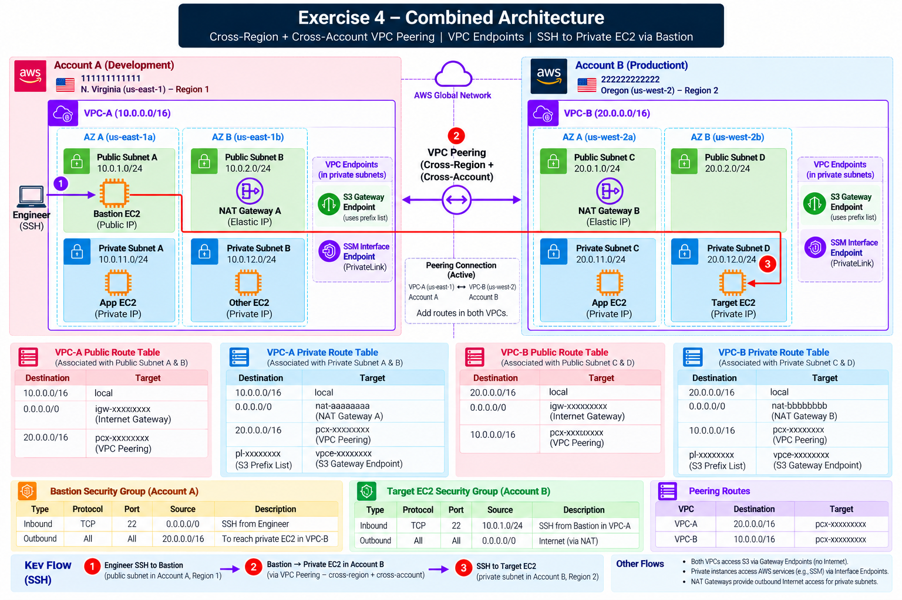

# Exercise 4 — Private Connectivity: VPC Peering & VPC Endpoints

**Days:** 7–8

## Scenario



OrderHub's corporate architecture requires multi-account segregation:
- **Development Environment:** Account A (`Account A ID`), Region `us-east-1` (`VPC-A`, CIDR `Development VPC CIDR`).
- **Production Environment:** Account B (`Account B ID`), Region `us-west-2` (`VPC-B`, CIDR `Production VPC CIDR`).

OrderHub developers in Account A need secure administrative access to target backend databases in Account B without sending traffic over the public internet. Furthermore, internal backend instances must access AWS S3 buckets and AWS Systems Manager (SSM) without routing traffic through NAT Gateways or exposing endpoints to the internet.

In this exercise, you will establish a **Cross-Account, Cross-Region VPC Peering Connection**, configure bi-directional route tables, deploy an **S3 Gateway Endpoint**, and set up **SSM Interface Endpoints** using AWS PrivateLink.

---

## Prerequisites

VPC Peering, CIDR, Route Tables, Cross-Account AWS, Cross-Region AWS, Gateway Endpoint, Interface Endpoint, DNS, Security Groups

---

## YouTube Videos

- **Gokce DB — How To: VPC Peering Connection | AWS | Between 2 VPCs in Different Accounts & Regions**
  - Link: https://www.youtube.com/watch?v=0mRA-KuXI2s
- **AWS Sessions — AWS VPC Endpoints | Interface Endpoint | Gateway Endpoint | AWS Sessions | Demo | PrivateLink**
  - Link: https://www.youtube.com/watch?v=-jwV98oyKqY
  - Verified Timestamps:
    - `00:00` — VPC endpoints
    - `02:41` — Interface endpoint introduction
    - `03:36` — Gateway endpoint introduction
    - `08:15` — Gateway endpoint demo
    - `12:30` — Interface endpoint demo
- **DevOps by Shaik Moulali — AWS Session Manager (SSM) Tutorial | Securely Access Private EC2 Instances Without SSH Keys & Bastion**
  - Link: https://www.youtube.com/watch?v=3J-V1myF1mM

---

## Build

Follow these steps to establish private connectivity across accounts, regions, and AWS services:

```text
Account A (us-east-1)                                Account B (us-west-2)
VPC-A (Development VPC CIDR)                         VPC-B (Production VPC CIDR)
 ├── Bastion EC2 (Bastion Private IP)                 ├── Target EC2 (Target Private IP)
 └── Public Route Table                              └── Private Route Table
      │                                                   │
      └───► Production VPC CIDR ──► [VPC Peering pcx-123] ◄── Development VPC CIDR ◄───┘
```

### Step 1 — Prepare VPCs Across Accounts & Regions
- Confirm **VPC-A** in Account A (`us-east-1`): `Development VPC CIDR`.
- Confirm **VPC-B** in Account B (`us-west-2`): `Production VPC CIDR`.
- Ensure `Development VPC CIDR` and `Production VPC CIDR` are planned as non-overlapping CIDR blocks.

### Step 2 — Create VPC Peering Connection
*A **VPC Peering Connection** is a networking connection between two VPCs that enables you to route traffic between them using private IPv4 addresses across accounts and regions, operating without gateway hardware or public internet exposure.*

1. In Account A (`us-east-1`), open **VPC > Peering Connections**.
2. Click **Create Peering Connection**:
   - **Name:** `VPC-A-to-VPC-B-Peering`
   - **VPC ID (Requester):** `VPC-A` (`Development VPC CIDR`)
   - **Account:** Another account → Enter `Account B ID`
   - **Region:** Another region → Select `us-west-2`
   - **VPC ID (Accepter):** Enter `VPC-B` ID.
3. Switch to Account B (`us-west-2`), open **Peering Connections**, select the pending request, and click **Accept Request**.

### Step 3 — Add Routes on Both Sides
1. **Account A (VPC-A Route Tables):**
   - In `Public-Route-Table` and `Private-Route-Table`, add route:
     - **Destination:** `Production VPC CIDR` | **Target:** `Peering Connection` (`pcx-xxxx`)
2. **Account B (VPC-B Route Tables):**
   - In `Private-Route-Table`, add route:
     - **Destination:** `Development VPC CIDR` | **Target:** `Peering Connection` (`pcx-xxxx`)

### Step 4 — Configure Security Groups for Cross-Region Peering
1. In Account B (`Target-EC2-SG`), add Inbound Rule:
   - Type: `SSH (TCP 22)` | Source: `Bastion Subnet CIDR` (Public Subnet A CIDR in Account A).
   - *Note:* Do NOT reference Security Group IDs (`sg-xxxx`) across regions; use CIDR blocks.

### Step 5 — Create S3 Gateway Endpoint
*A **Gateway Endpoint** is a free VPC endpoint type that targets a specific route table entry using an AWS service Prefix List. It directs Amazon S3 traffic over the AWS internal network backbone, completely bypassing the internet and NAT Gateway.*

1. In Account A (`VPC-A`), open **VPC > Endpoints > Create endpoint**.
2. Service category: `AWS services` | Service name: `com.amazonaws.us-east-1.s3` (Type: **Gateway**).
3. Select `VPC-A` and associate with `Private-Route-Table`.
4. Verify that `Private-Route-Table` automatically receives a route:
   - **Destination:** `S3 Prefix List` | **Target:** `S3 Gateway Endpoint` (`vpce-xxxx`).

### Step 6 — Create SSM Interface Endpoints (AWS PrivateLink)
*An **Interface Endpoint** (powered by AWS PrivateLink) provisions Elastic Network Interfaces (ENIs) with private IP addresses inside your private subnets. **AWS Systems Manager (SSM)** Session Manager uses these endpoints to grant secure shell access to private EC2 instances without requiring open inbound SSH ports, public IP addresses, or a Bastion host.*

#### HTTPS — TCP 443 for SSM Interface Endpoints
- **Why:** SSM API communication requires encrypted HTTPS web service requests over PrivateLink.
- **Why TCP:** HTTPS uses TCP for connection reliability and TLS for encryption and identity verification.
- **Why port 443:** Standard destination port assigned for HTTPS/TLS traffic.
- **If blocked:** The SSM Agent on private EC2 instances cannot register or establish terminal sessions, causing SSM Console to report `Target instance is not connected`.
- **What to check:** Endpoint Security Group Inbound HTTPS 443 → VPC Private DNS → Private Subnet Route Table → SSM Agent Status.

1. Open **VPC > Endpoints > Create endpoint** in `VPC-A`.
2. Create Interface Endpoints for SSM services:
   - `com.amazonaws.us-east-1.ssm`
   - `com.amazonaws.us-east-1.ssmmessages`
   - `com.amazonaws.us-east-1.ec2messages`
3. Select `VPC-A` and private subnets (`Private-Subnet-A`, `Private-Subnet-B`).
4. Enable **Enable Private DNS name**.
5. Attach a Security Group (`SSM-VPCE-SG`) allowing inbound TCP 443 from `Development VPC CIDR`.

### Step 7 — Verify Private Connectivity
- From `Bastion-EC2` in Account A (`Bastion Private IP`), run:
  `ssh ec2-user@<TARGET-PRIVATE-IP-ACCOUNT-B>`.

---

## Scenario-Based Verification & Troubleshooting

### Scenario 1 — Active Peering Connection but Traffic Fails
- **Symptom:** In Account A console, the Peering Connection shows state `Active`. However, running SSH from Bastion to Target Private IP results in `Connection timed out`.
- **Investigation:**
  1. Inspect `VPC-A` Public Route Table in Account A. Does it have `Production VPC CIDR → pcx-xxxx`?
  2. Inspect `VPC-B` Private Route Table in Account B. Does it have `Development VPC CIDR → pcx-xxxx`?
  3. Inspect `Target-EC2-SG` in Account B. Does it permit inbound TCP 22 from `Bastion Subnet CIDR`?
- **Verification:** Explain why `Active` status only means AWS established the virtual link. Traffic fails until BOTH side route tables and security groups are configured.
- **Reasoning:** VPC Peering is a virtual network interface between two VPCs. AWS does not automatically inject routes or modify firewalls when peering is accepted.

### Scenario 2 — One-Way Route Configuration
- **Symptom:** Account A route table has `Production VPC CIDR → pcx-xxxx`, but Account B route table is missing `Development VPC CIDR → pcx-xxxx`. Traffic fails.
- **Investigation:**
  1. Trace packet from Bastion Private IP to destination Target Private IP. Packet reaches Target EC2.
  2. Target EC2 sends SYN-ACK response packet back to Bastion Private IP.
  3. Target EC2 checks Account B route table for destination Bastion Private IP.
- **Questions to Answer:**
  - What happens when Account B has no route for `Development VPC CIDR`?
  - Where does Account B's router send the return packet?
- **Verification:** Add `Development VPC CIDR → pcx-xxxx` to Account B Private Route Table. Retest SSH.
- **Reasoning:** Network communication requires bi-directional routing. Even if the request reaches the target, response packets will be dropped at the target's VPC router if no return route exists.

### Scenario 3 — Attempting to Peer Overlapping CIDRs
- **Symptom:** An administrator attempts to peer `VPC-A` (`Development VPC CIDR`) with a legacy staging VPC configured with the exact same CIDR block. AWS Console returns an error during creation.
- **Investigation:**
  1. Check IPv4 CIDR blocks for both VPCs.
- **Questions to Answer:**
  - Why does AWS API block peering requests between overlapping CIDRs?
  - How would IP routing break if two peered networks both claimed the same subnet CIDR?
- **Verification:** Document why CIDRs must be strictly non-overlapping before creating VPCs.
- **Reasoning:** Routers cannot determine whether an IP address refers to a local host or a peered remote host when CIDR blocks overlap.

### Scenario 4 — Non-Transitive VPC Peering Behavior
- **Symptom:** The organization has three VPCs: `VPC-A` ↔ `VPC-B` ↔ `VPC-C`. `VPC-A` is peered with `VPC-B`, and `VPC-B` is peered with `VPC-C`. A developer expects `VPC-A` to reach `VPC-C` through `VPC-B`.
- **Investigation:**
  1. Attempt to send traffic from `VPC-A` (`Development VPC CIDR`) to `VPC-C` (`VPC-C CIDR`).
- **Questions to Answer:**
  - Does AWS VPC Peering support transitive routing?
  - Will `VPC-B` act as an intermediate transit router between `VPC-A` and `VPC-C`?
  - What direct peering architecture (`VPC-A` ↔ `VPC-C`) is required?
- **Verification:** Explain non-transitive routing principles. Confirm `VPC-A` cannot reach `VPC-C` without an explicit direct peering connection (`VPC-A` ↔ `VPC-C`).
- **Reasoning:** AWS VPC Peering explicitly enforces non-transitive routing. Edge-to-edge routing across intermediate peered VPCs is blocked to prevent accidental network transit loops and security cross-talk.

### Scenario 5 — S3 Traffic Routing: Gateway Endpoint vs NAT Gateway
- **Symptom:** An application on `App-EC2` uploads large files to Amazon S3. The finance team notices high NAT Gateway data processing charges.
- **Investigation:**
  1. Inspect `Private-Route-Table`.
  2. Run `traceroute s3.us-east-1.amazonaws.com` from `App-EC2`.
- **Questions to Answer:**
  - Does S3 traffic route over `0.0.0.0/0 → NAT Gateway` when no Gateway Endpoint exists?
  - What route entry does an S3 Gateway Endpoint add to the route table?
  - Why is an S3 Gateway Endpoint free of charge and more performant than NAT?
- **Verification:** Attach S3 Gateway Endpoint to `Private-Route-Table`. Confirm S3 prefix list route appears. Verify traffic bypasses NAT Gateway.
- **Reasoning:** S3 Gateway Endpoints inject a specific prefix list route into the VPC route table. Because prefix routes are more specific than `0.0.0.0/0`, S3 traffic routes directly over the AWS internal network backbone, eliminating NAT processing fees.

### Scenario 6 — Hostname Resolves to Public IP Instead of Private ENI IP
- **Symptom:** A private EC2 instance makes an API call to `https://ssm.us-east-1.amazonaws.com`. Traffic fails because it attempts to route over the public internet instead of using the Interface Endpoint ENI.
- **DNS Protocol Investigation:**
  1. Run `nslookup ssm.us-east-1.amazonaws.com` on the private EC2 instance.
  2. Check if the DNS query returns a public IP address or a local VPC private ENI IP.
  3. Inspect the Interface Endpoint attribute **Enable Private DNS name**.
- **Questions to Answer:**
  - Why does standard public DNS resolve `ssm.us-east-1.amazonaws.com` to public internet IP addresses?
  - How does enabling Private DNS override public DNS resolution so standard hostnames resolve directly to the Interface Endpoint private ENI IP?
- **Verification:** Enable Private DNS name on the Interface Endpoint. Re-run `nslookup ssm.us-east-1.amazonaws.com` and confirm it resolves to the local private ENI IP in `VPC-A`.
- **Reasoning:** Security Groups and Route Tables act on IP addresses. If DNS resolves an AWS service hostname to a public IP instead of the Interface Endpoint private IP, traffic targets the default NAT route instead of PrivateLink.

### Scenario 7 — SSM Session Manager Fails When TCP 443 Is Blocked
- **Symptom:** An engineer attempts to connect to `App-EC2` via SSM Session Manager, but the console displays `Target instance is not connected`.
- **Systematic Troubleshooting Order:**
  ```text
  1. SSM Agent Running ──► 2. IAM Role (AmazonSSMManagedInstanceCore) ──► 3. VPC DNS Enabled ──► 4. Interface Endpoints Active ──► 5. Endpoint SG TCP 443
  ```
- **Hands-on Protocol Test:**
  1. Verify SSM connection succeeds when `SSM-VPCE-SG` allows Inbound `HTTPS (TCP 443)`.
  2. Remove the `TCP 443` Inbound rule from `SSM-VPCE-SG`.
  3. Attempt SSM Session connection — verify that connection fails because HTTPS API traffic is blocked.
- **Execution:** Re-add `TCP 443` Inbound rule from `Development VPC CIDR`. Retest SSM Session Manager connection.

### Scenario 8 — Security Group Reference Across Cross-Region Peering
- **Symptom:** An admin tries to configure `Target-EC2-SG` in Account B (`us-west-2`) by adding an inbound rule referencing `sg-12345` (Bastion SG in `us-east-1`). AWS Console displays an invalid parameter error.
- **Investigation:**
  1. Analyze cross-region security group referencing rules.
- **Questions to Answer:**
  - Can Security Group IDs be referenced across different AWS Regions in VPC Peering?
  - What source format must be used for cross-region peering security rules?
- **Verification:** Replace Security Group ID reference with explicit source CIDR block (`Bastion Subnet CIDR`) in `Target-EC2-SG`.
- **Reasoning:** AWS Security Group ID referencing across VPC Peering is supported ONLY within the same AWS Region. Cross-region peering requires IPv4 CIDR-based security group rules.

---

## Networking

- **VPC Peering:** A networking connection between two VPCs that enables traffic routing between them using private IPv4 addresses.
- **Cross-Account Peering:** A peering connection established between VPCs owned by two different AWS Accounts.
- **Cross-Region Peering:** A peering connection established between VPCs located in two different AWS Regions.
- **Non-Transitive Routing:** A routing constraint where traffic cannot pass through an intermediate peered network to reach a third network (`A ↔ B ↔ C` does not equal `A ↔ C`).
- **Gateway Endpoint:** A free VPC endpoint type (for S3) that targets a route table entry using a prefix list.
- **Interface Endpoint (AWS PrivateLink):** A paid VPC endpoint type that provisions Elastic Network Interfaces (ENIs) with private IPs in your subnets to consume AWS services privately.
- **Endpoint ENI:** A virtual network interface created in a subnet that serves as the entry point for traffic destined for an Interface Endpoint service.
- **Private DNS for Endpoints:** A feature that overrides standard AWS service domain names to resolve to the private IP addresses of Interface Endpoint ENIs.
- **S3 Prefix List:** A managed set of IP address ranges representing Amazon S3 public endpoints, used in VPC route tables.
- **Systems Manager (SSM):** AWS service enabling secure instance management without requiring open inbound SSH ports or public IP addresses.

---

## Useful Tips

- An `Active` status on a VPC Peering Connection only means the virtual link exists; traffic will fail until route tables and security groups on BOTH sides are configured.
- Cross-region VPC Peering does NOT support referencing Security Group IDs in rules; always specify explicit IPv4 CIDRs.
- Gateway Endpoints (for S3) modify route tables and carry no hourly cost; Interface Endpoints (for SSM) deploy ENIs, require Security Groups, and incur hourly charges.
- Always verify that VPC DNS Resolution and DNS Hostnames are enabled when setting up Interface Endpoints.
- Systems Manager (SSM) requires three interface endpoints (`ssm`, `ssmmessages`, `ec2messages`) along with the `AmazonSSMManagedInstanceCore` IAM policy.
