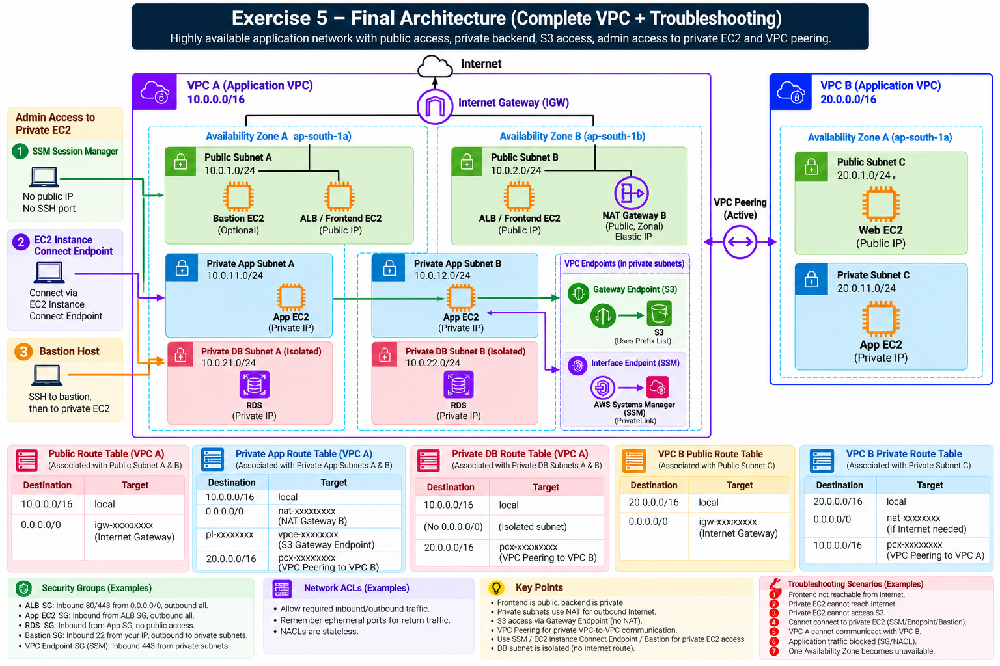

# Exercise 5 — Master VPC Build & Troubleshooting

**Days:** 9–10

## Scenario



You are the Lead Cloud & Backend Infrastructure Engineer for **OrderHub**. Your organization has mandated a complete enterprise-grade multi-account, cross-region AWS networking footprint.

The system spans two AWS accounts and regions:
- **Development Environment:** Account A (`Account A ID`), Region `us-east-1`, `VPC-A` (`Development VPC CIDR`).
- **Production Environment:** Account B (`Account B ID`), Region `us-west-2`, `VPC-B` (`Production VPC CIDR`).

The architecture supports multi-AZ redundancy, isolated public and private subnets, NAT-based outbound access, secure cross-account administration over VPC Peering, private S3 Gateway Endpoints, SSM Session Management via Interface Endpoints, fine-grained Security Groups, stateless NACLs, and diagnostic logging tools.

In this master exercise, you will review and assemble the complete canonical OrderHub enterprise architecture, verify the end-to-end administration flow, and resolve 12 real-world production network incidents.

---

## Prerequisites

VPC, CIDR, Subnet, AZ, Route Table, IGW, NAT, Security Group, NACL, VPC Peering, Gateway Endpoint, Interface Endpoint, SSM, Flow Logs, Reachability Analyzer

---

## YouTube Videos

- **Abhishek.Veeramalla — Day-7 | AWS Project Used In Production | Complete Implementation**
  - Link: https://www.youtube.com/watch?v=FZPTL_kNvXc
  - **Watch for:** Multi-account VPC setup, production network architecture, route tables
- **Abhishek.Veeramalla — Day-8 | AWS Scenario Based Interview Questions on EC2, IAM and VPC**
  - Link: https://www.youtube.com/watch?v=qtkWHhikLh8
  - **Watch for:** VPC scenario interview questions, EC2/VPC troubleshooting

---

## Build

Review and assemble the full canonical OrderHub multi-account architecture:

```text
[Account A — Development (Account A ID / us-east-1)]
VPC-A: Development VPC CIDR
 ├── AZ-A (us-east-1a)
 │    ├── Public Subnet A (Public Subnet A CIDR) ──► Contains: Bastion EC2 (Public IP)
 │    └── Private Subnet A (Private Subnet A CIDR) ──► Contains: App / Other EC2 (Private IP)
 └── AZ-B (us-east-1b)
      ├── Public Subnet B (Public Subnet B CIDR) ──► Contains: NAT Gateway A (Elastic IP)
      └── Private Subnet B (Private Subnet B CIDR) ──► Contains: Other EC2 (Private IP)

 Account A Networking Components:
  • Internet Gateway (IGW-A)
  • Public Route Table:  VPC-A CIDR → local | 0.0.0.0/0 → IGW-A | Production VPC CIDR → pcx-xxxx
  • Private Route Table: VPC-A CIDR → local | 0.0.0.0/0 → NAT-A | Production VPC CIDR → pcx-xxxx | S3 Prefix List → vpce-s3
  • S3 Gateway Endpoint
  • SSM Interface Endpoints (ssm, ssmmessages, ec2messages)
  • Bastion Security Group: Inbound TCP 22 from 0.0.0.0/0 | Outbound All Traffic to Production VPC CIDR
  • Target Security Group (Account A): Inbound TCP 22 from Bastion Subnet CIDR | Outbound All Traffic

                     ▲
                     │ Cross-Account / Cross-Region VPC Peering (pcx-xxxx)
                     ▼

[Account B — Production (Account B ID / us-west-2)]
VPC-B: Production VPC CIDR
 ├── AZ-A (us-west-2a)
 │    ├── Public Subnet C (Public Subnet C CIDR) ──► Contains: NAT Gateway B (Elastic IP)
 │    └── Private Subnet C (Private Subnet C CIDR) ──► Contains: App EC2 (Private IP)
 └── AZ-B (us-west-2b)
      ├── Public Subnet D (Public Subnet D CIDR)
      └── Private Subnet D (Private Subnet D CIDR) ──► Contains: Target EC2 (Private IP)

 Account B Networking Components:
  • Internet Gateway (IGW-B)
  • Public Route Table:  VPC-B CIDR → local | 0.0.0.0/0 → IGW-B
  • Private Route Table: VPC-B CIDR → local | 0.0.0.0/0 → NAT-B | Development VPC CIDR → pcx-xxxx | S3 Prefix List → vpce-s3
  • S3 Gateway Endpoint
  • SSM Interface Endpoints
  • Target Security Group (Account B): Inbound TCP 22 from Bastion Subnet CIDR | Outbound All Traffic
```

### Main Administration Architecture Flow:
*In this architecture flow, the **Bastion Host** (in Account A Public Subnet A) serves as the secure administrative entry point over SSH (TCP 22). The **Target EC2** (in Account B Private Subnet D) is the private workload instance you are testing connectivity to over VPC Peering without exposing it directly to the internet.*

```text
Engineer (Internet)
   │
   ▼ (SSH TCP 22)
Bastion EC2 [Account A / Public Subnet A (Bastion Private IP)]
   │
   ▼ (VPC Peering pcx-xxxx)
Target EC2 [Account B / Private Subnet D (Target Private IP)]
```

---

## Scenario-Based Verification & Troubleshooting

Solve the following 12 realistic production incidents:

### Incident 1 — Bastion Cannot Reach Target Across Peering (TCP 22 Blocked)
- **Symptom:** Developer on `Bastion-EC2` (`Bastion Private IP`) attempts to SSH to `Target-EC2` (`Target Private IP`) in Account B over VPC Peering. SSH command times out.
- **Protocol Analysis (SSH — TCP 22):**
  - **Why:** SSH provides secure remote command-line terminal access across the peering connection.
  - **Why TCP:** SSH requires connection-oriented reliable delivery so terminal packets are not dropped.
  - **Why port 22:** Standard destination port assigned for SSH traffic.
  - **If blocked:** Connection times out even if peering routes are completely active.
- **Troubleshooting Steps:**
  1. Inspect Peering Connection state in Account A/B (`Active`).
  2. Inspect Account A `Public-Route-Table`: Verify route `Production VPC CIDR → pcx-xxxx` exists.
  3. Inspect Account B `Private-Route-Table`: Verify return route `Development VPC CIDR → pcx-xxxx` exists.
  4. Inspect Account B `Target-EC2-SG`: Verify inbound TCP 22 from source `Bastion Subnet CIDR`.
  5. Inspect Account B `Private-Subnet-D` NACL: Verify inbound/outbound rules permit TCP 22 & ephemeral ports.
- **Verification:** Correct the missing route or security group rule. SSH from Bastion to Target EC2 succeeds.

### Incident 2 — Production Target Cannot Reach Internet for Package Updates (HTTP/HTTPS Outbound)
- **Symptom:** `Target-EC2` (`Target Private IP`) in Account B fails to download OS security patches via `apt-get` or `yum` over HTTPS (TCP 443).
- **Troubleshooting Steps:**
  1. Inspect `Private-Subnet-D` route table in Account B. Verify route `0.0.0.0/0 → NAT-Gateway-B`.
  2. Inspect `NAT-Gateway-B` status in `us-west-2` console. Ensure status is `Available`.
  3. Verify `NAT-Gateway-B` is located in `Public-Subnet-C` (`Public Subnet C CIDR`).
  4. Inspect `Public-Route-Table` in Account B for `0.0.0.0/0 → IGW-B`.
  5. Confirm Elastic IP is attached to `NAT-Gateway-B`.
- **Verification:** Run `curl https://ifconfig.me` on `Target-EC2`. Confirm output matches the Elastic IP assigned to `NAT-Gateway-B`.
- **Reasoning:** Outbound internet flow requires: `Private EC2 → Private RT → NAT GW (in Public Subnet) → Public RT → IGW → Internet`. Breaking any link disables outbound connectivity.

### Incident 3 — S3 Access Uses NAT Gateway Unexpectedly
- **Symptom:** The finance department alerts the team that Account A NAT Gateway data charges surged by \$1,200 due to S3 data transfers.
- **Troubleshooting Steps:**
  1. Inspect Account A `Private-Route-Table`. Check if `S3 Gateway Endpoint` route is missing.
  2. If S3 Gateway Endpoint route (`S3 Prefix List → vpce-xxxx`) is absent, traffic to S3 defaults to `0.0.0.0/0 → NAT-Gateway-A`.
- **Verification:** Associate `S3 Gateway Endpoint` with `Private-Route-Table`. Run `aws s3 ls --region us-east-1` from private EC2 and confirm traffic matches the prefix list route instead of default NAT.
- **Reasoning:** S3 Gateway Endpoints inject prefix list routes that are more specific than `0.0.0.0/0`. Missing endpoints force S3 traffic through NAT Gateway, incurring heavy per-GB data processing charges.

### Incident 4 — SSM Session Manager Fails for Private Instance (HTTPS TCP 443)
- **Symptom:** An engineer tries to open an SSM Session Manager shell to `Private-EC2` in Account A (`Private EC2 Private IP`). The SSM console reports `Target instance not connected`.
- **Protocol Analysis (HTTPS — TCP 443):**
  - **Why:** SSM Session Manager transmits encrypted API control streams over TLS port 443.
  - **If blocked:** The SSM Agent daemon cannot establish an API websocket channel to AWS SSM endpoints.
- **Troubleshooting Steps:**
  1. **IAM Role:** Verify EC2 instance profile has `AmazonSSMManagedInstanceCore` policy attached.
  2. **SSM Agent:** Verify SSM Agent daemon is running on OS.
  3. **VPC DNS:** Verify VPC settings **Enable DNS resolution** and **Enable DNS hostnames** are `True`.
  4. **Interface Endpoints:** Verify endpoints for `ssm`, `ssmmessages`, `ec2messages` exist in `VPC-A`.
  5. **Endpoint Security Group:** Verify `SSM-VPCE-SG` permits Inbound HTTPS (TCP 443) from `Development VPC CIDR`.
- **Verification:** Click **Start Session** in SSM Console. Verify successful terminal shell prompt.

### Incident 5 — Security Group Inbound Rule Is Allowed but Connection Fails
- **Symptom:** Security Group for a database instance permits TCP port 5432 from `Private Subnet A CIDR`. However, database connection attempts hang indefinitely.
- **Troubleshooting Steps:**
  1. Check Subnet Network ACLs (NACLs) attached to the database subnet.
  2. Inspect NACL Inbound Rules: Confirm rule allows TCP 5432.
  3. Inspect NACL Outbound Rules: Check if outbound rule blocking return traffic (ephemeral ports 1024–65535) exists.
- **Verification:** Add NACL Outbound rule allowing TCP 1024–65535 to `Private Subnet A CIDR`. Retest database connection.
- **Reasoning:** Security Groups are stateful (auto-allow return packets), but NACLs are stateless. If a NACL outbound rule blocks return traffic on client ephemeral ports, the TCP handshake fails despite valid Security Group rules.

### Incident 6 — Multiple Routes Exist: Which Route Wins?
- **Symptom:** `Private-Route-Table` contains the following entries:
  - Route A: `VPC CIDR → local`
  - Route B: `0.0.0.0/0 → NAT-Gateway-A`
  - Route C: `Production VPC CIDR → pcx-xxxx`
  - Route D: `Target Subnet CIDR → pcx-xxxx`
  A packet is addressed to an IP located inside `Target Subnet CIDR`.
- **Troubleshooting Inquiry:**
  - Which route entry matches the packet?
  - Why does Route D (`Target Subnet CIDR`) win over Route C (`Production VPC CIDR`) and Route B (`0.0.0.0/0`)?
- **Verification:** Confirm AWS router routes the packet to `Route D` based on **Longest Prefix Match** (the target subnet mask has more matching network bits, making it more specific than the VPC CIDR or default route).
- **Reasoning:** Routers always prioritize the route with the highest mask length (longest prefix) matching the destination IP.

### Incident 7 — One-Direction Traffic Initiation Works, Reverse Fails
- **Symptom:** Host in Account A (`Bastion Private IP`) can initiate SSH to Host in Account B (`Target Private IP`). However, Host in Account B (`Target Private IP`) cannot initiate SSH to Host in Account A (`Bastion Private IP`).
- **Troubleshooting Steps:**
  1. Inspect `Bastion-SG` in Account A. Does it have an Inbound Rule allowing SSH (TCP 22) from `Production VPC CIDR` or `Target Subnet CIDR`?
  2. Inspect Account A `Bastion-SG` outbound rules vs Account B `Target-SG` inbound rules.
- **Verification:** Explain why stateful firewalls allow return packets for connections initiated by Account A, but drop new connection attempts initiated by Account B unless explicit inbound rules exist in Account A's Security Group.
- **Reasoning:** Security Groups automatically permit return traffic for connections initiated locally. Initiating a connection in the reverse direction requires explicit inbound Security Group rules on the receiving end.

### Incident 8 — Private Endpoint DNS Resolution Failure
- **Symptom:** Application on `Private-EC2` calls `https://sqs.us-east-1.amazonaws.com` but receives a public IP address instead of internal private IP.
- **Troubleshooting Steps:**
  1. Inspect `VPC-A` settings: **Enable DNS resolution** (`True`) and **Enable DNS hostnames** (`True`).
  2. Inspect SQS Interface Endpoint settings: Verify **Enable Private DNS name** is checked.
- **Verification:** Enable Private DNS name on SQS Interface Endpoint. Run `dig sqs.us-east-1.amazonaws.com` and confirm answer resolves to a private IP in `VPC-A`.
- **Reasoning:** Private DNS overrides public DNS hostnames to point to Interface Endpoint ENIs. If Private DNS is disabled, DNS resolves to AWS public endpoints over the internet/NAT path.

### Incident 9 — Cross-Region Peering Rule Misconfiguration
- **Symptom:** Administrator configures an inbound Security Group rule in Account B (`us-west-2`) referencing `sg-0a1b2c3d4e5f` (Bastion SG in Account A `us-east-1`). The AWS Console throws an error.
- **Troubleshooting Steps:**
  1. Check AWS Region placement of source SG (`us-east-1`) vs destination SG (`us-west-2`).
- **Verification:** Replace Security Group ID reference with explicit source CIDR (`Bastion Subnet CIDR`).
- **Reasoning:** AWS does not support Security Group ID references across different AWS Regions over VPC Peering. Cross-region rules must strictly use IPv4/IPv6 CIDR blocks.

### Incident 10 — VPC Flow Logs Investigation (`ACCEPT` vs `REJECT`)
- **Symptom:** A backend microservice cannot send events to a database. You need concrete diagnostic evidence.
- **Troubleshooting Steps:**
  1. Open CloudWatch Log Insights for `VPC-A` Flow Logs.
  2. Run query filtering by destination:
     `fields @timestamp, srcAddr, dstAddr, dstPort, action, logStatus`
     `| filter dstAddr = 'Target Private IP' and dstPort = 5432`
  3. Analyze results:
     - If `action == 'REJECT'`: Traffic blocked by SG or NACL.
     - If `action == 'ACCEPT'`: Network path is open; check database service status or local OS firewall (`iptables`/`ufw`).
- **Verification:** Use Flow Log empirical evidence to apply the exact fix.
- **Reasoning:** VPC Flow Logs eliminate guesswork by documenting whether AWS ENI firewalls explicitly accepted or rejected packets.

### Incident 11 — Reachability Analyzer Path Diagnostics
- **Symptom:** Complex multi-hop path between `Bastion-EC2` and `Target-EC2` is failing, and manual inspection is inconclusive.
- **Troubleshooting Steps:**
  1. Open **VPC > Reachability Analyzer**.
  2. Create path analysis from `Bastion-EC2` ENI to `Target-EC2` ENI on port 22.
  3. Analyze intermediate hop analysis output:
     `Source ENI → Public RT → Peering Connection → Private RT → NACL → Target SG → Target ENI`
- **Verification:** Identify the exact component highlighted in red (e.g., `Target SG: No matching inbound rule`). Fix configuration and re-run Reachability Analyzer until status reads `REACHABLE`.
- **Reasoning:** Reachability Analyzer deterministically evaluates network configuration models across VPC components without sending live packets.

### Incident 12 — Architecture Health & Vulnerability Review
- **Symptom:** Audit the entire OrderHub network architecture for single-point-of-failures, security risks, and routing misconfigurations.
- **Required Architecture Review Findings:**
  1. **Single-AZ NAT Gateway Risk:** `NAT-Gateway-A` resides in `AZ-B` (`Public-Subnet-B`). If `AZ-B` fails, private instances in `AZ-A` (`Private-Subnet-A`) lose outbound internet access. *Fix for Production:* Deploy one NAT Gateway per AZ.
  2. **Security Risk (Overly Permissive Bastion SG):** `Bastion-SG` inbound SSH is open to `0.0.0.0/0`. *Fix:* Restrict SSH to explicit corporate IP CIDR.
  3. **Overly Permissive Outbound Rules:** Private instances allow `0.0.0.0/0` outbound. *Fix:* Restrict outbound rules to required service CIDRs/ports.
  4. **Unnecessary NAT Dependency:** S3 traffic using NAT instead of Gateway Endpoint. *Fix:* Use S3 Gateway Endpoint.
  5. **Admin Access Strategy:** SSH Bastion requires key management and public IP exposure. *Fix:* Migrate to SSM Session Manager via Interface Endpoints to eliminate bastion host requirement.

---

## Networking

- **CIDR (Classless Inter-Domain Routing):** Standard IP address allocation method defining network masks (e.g., `/16` vs `/24`).
- **Subnets:** Segmented subdivisions of a VPC IP range bound to a single Availability Zone.
- **Availability Zones:** Physically isolated AWS data center facilities designed for fault tolerance.
- **Route Tables:** Dynamic routing rule tables that direct traffic leaving subnets and gateways.
- **Longest Prefix Match:** IP routing rule prioritizing the most specific subnet mask matching a destination IP address.
- **Internet Gateway (IGW):** VPC component enabling bi-directional 1:1 NAT communication between public subnets and the internet.
- **NAT Gateway:** Zonal AWS service enabling outbound-only 1:Many NAT for private subnets.
- **Security Groups:** Stateful firewalls controlling traffic at the ENI level.
- **Network ACLs (NACLs):** Stateless firewalls controlling traffic at the subnet boundary.
- **VPC Peering:** Private networking connection linking two VPCs across accounts and regions.
- **Gateway Endpoint:** Route table target endpoint for S3 (no hourly charge).
- **Interface Endpoint:** ENI-based endpoint powered by AWS PrivateLink for private service access.
- **VPC DNS:** Amazon-provided DNS Resolver (at base VPC network + 2) required for private domain name resolution.
- **VPC Flow Logs:** Packet metadata logging mechanism capturing ACCEPT/REJECT status at ENIs.
- **Reachability Analyzer:** Static path analysis tool for testing VPC component connectivity.
- **SSM Session Manager:** Secure instance management service eliminating SSH keys and bastion hosts.

---

## Useful Tips

- **10-Step Practical AWS Network Troubleshooting Protocol:**
  1. Confirm exact **Source IP** and **Destination IP**.
  2. Check **Source Subnet Route Table** for valid route target.
  3. Check **Peering / NAT / Endpoint Path** state and placement.
  4. Inspect **Source and Destination Security Groups** (Stateful: check inbound/outbound).
  5. Inspect **Subnet Network ACLs (NACLs)** (Stateless: check inbound AND outbound ephemeral ports 1024–65535).
  6. Check **IAM Roles & SSM Agent** status when inspecting instance management.
  7. Check **VPC DNS Settings** (**DNS resolution** & **DNS hostnames**) when private endpoints fail.
  8. Run **VPC Flow Logs** to confirm `ACCEPT` vs `REJECT` action.
  9. Run **Reachability Analyzer** to pinpoint exact blocking configuration component.
  10. Retest connectivity after every single change and document root cause.
